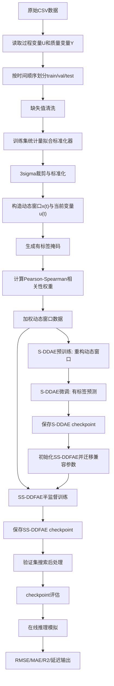
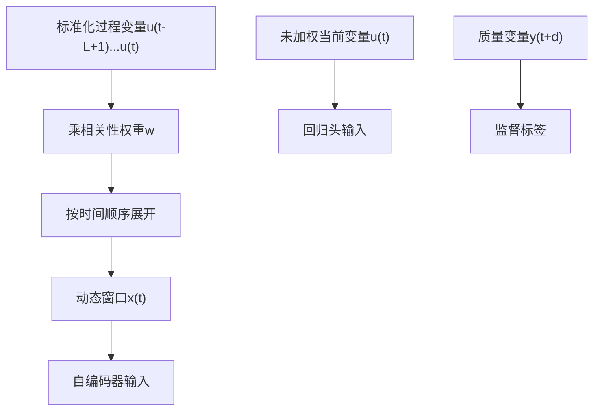
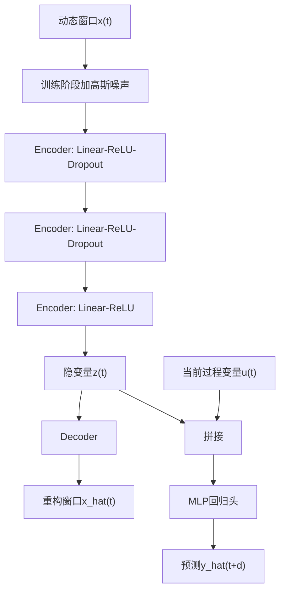
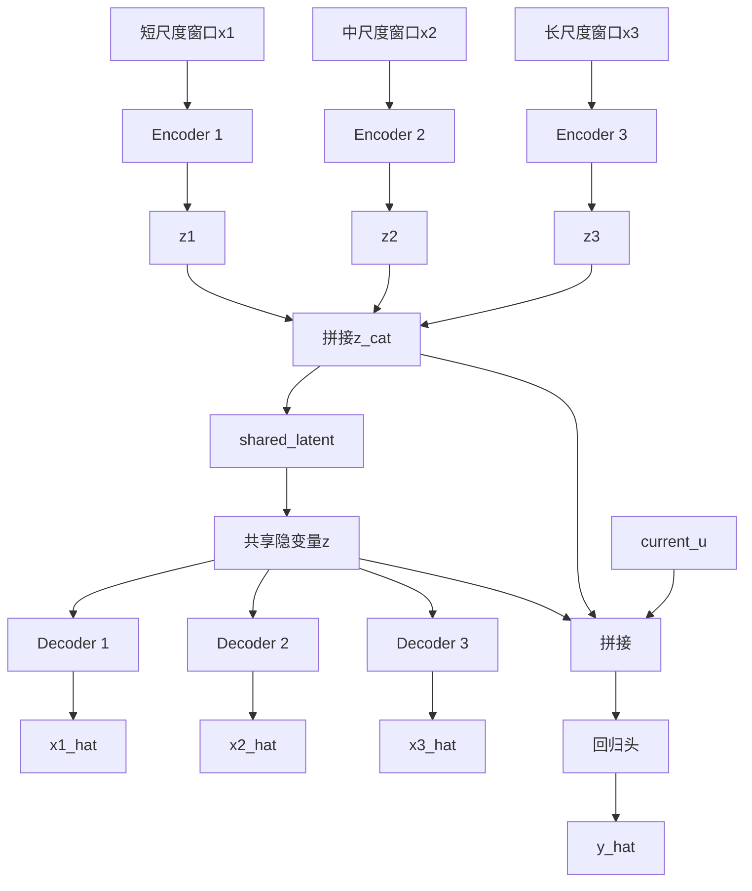
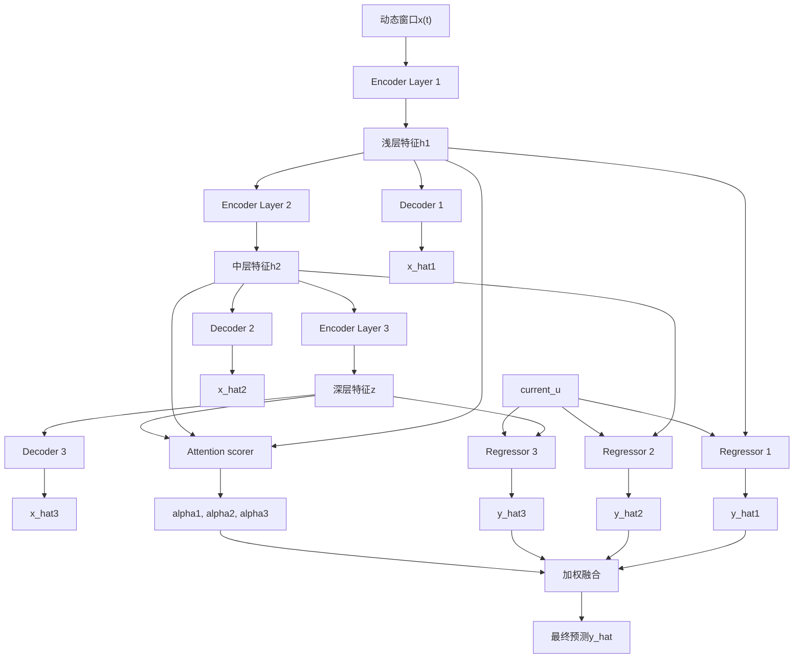
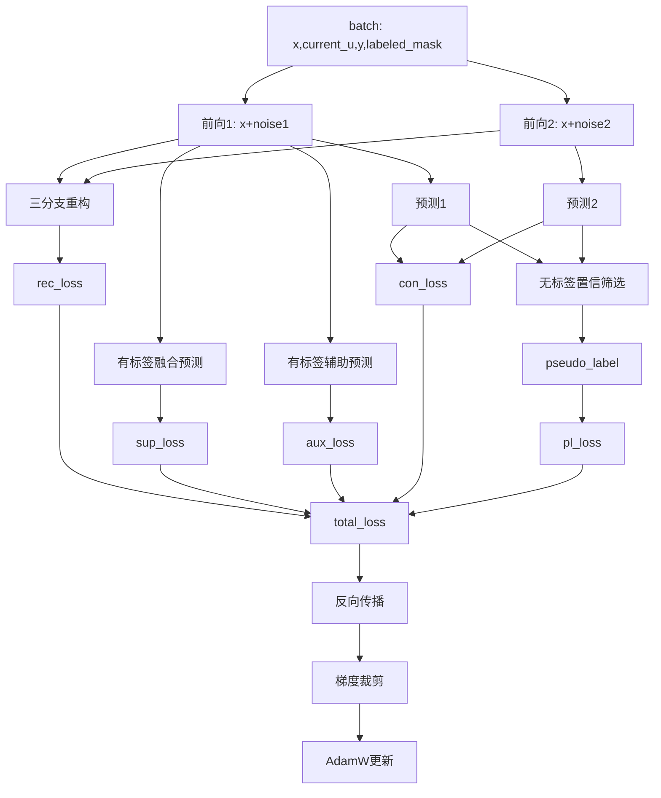
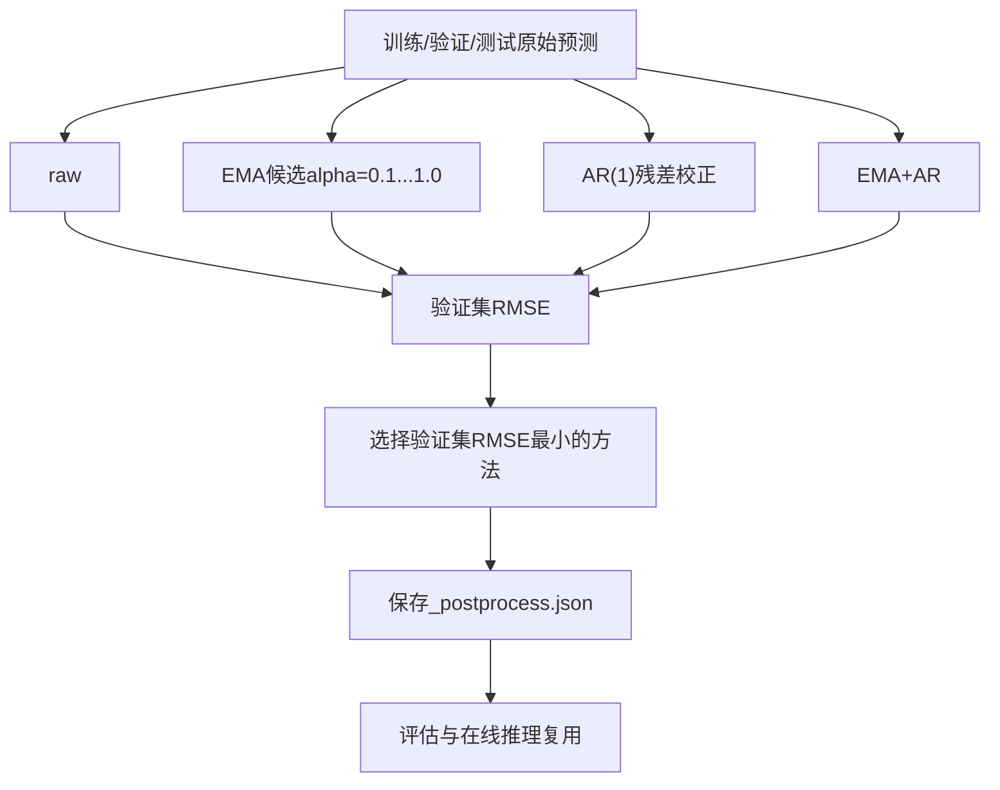
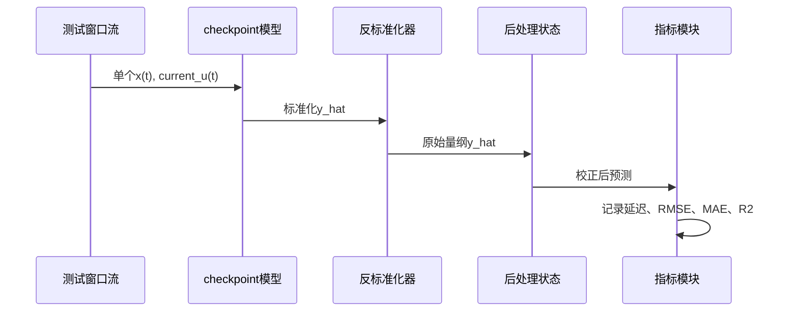

# DeepQuality 算法结构图与实现步骤

## 1. 总体结构图



## 2. 数据处理结构图

```mermaid
flowchart LR
    A["CSV"] --> B["load_csv_dataset"]
    B --> C["chronological_split"]
    C --> D["clean_missing_values"]
    D --> E["Standardizer.fit(train)"]
    E --> F["clip到训练集3sigma范围"]
    F --> G["标准化X和Y"]
    G --> H["nested_label_masks"]
    H --> I["compute_correlation_weights"]
    I --> J["make_windows / make_multiscale_windows"]
    J --> K["train/val/test窗口数据"]
```



实现步骤：

1. 从 `data.path` 读取 CSV，`target_column` 作为质量变量，其他列作为过程变量。
2. 按时间顺序划分训练集、验证集、测试集，不打乱样本。
3. 对每个划分分别清洗缺失值：删除连续缺失长度大于 `5` 的行段；任一列缺失率大于等于 `0.01` 时报错；剩余缺失按列线性插值。
4. 只用训练集计算输入和输出的均值、标准差、3sigma上下界。
5. 对训练集、验证集、测试集执行 3sigma 裁剪和标准化。
6. 根据 `label_ratio` 和随机种子生成训练窗口的有标签掩码。
7. 在训练集有标签样本上计算过程变量与质量变量的 Pearson 和 Spearman 综合相关性权重。
8. 构造窗口时先对过程变量乘相关性权重，再展开成动态窗口。
9. 单尺度窗口使用 `window_size` 和 `quality_delay`，输入为 `x(t)`，标签为 `y(t+d)`。
10. 多尺度窗口使用多个 `(window_size, stride)`，不同尺度共用同一组窗口结束时刻。

## 3. 动态窗口构造



单尺度输入：

```text
x(t) = [w*u(t-L+1), w*u(t-L+2), ..., w*u(t)]
current_u(t) = u(t)
target(t) = y(t + quality_delay)
```

多尺度输入：

```text
x_k(t) = [w*u(t-(L_k-1)*s_k), ..., w*u(t-s_k), w*u(t)]
```

其中 `L_k` 是第 `k` 个尺度窗口长度，`s_k` 是采样步长。

## 4. S-DDAE 结构图



实现步骤：

1. 初始化 `SupervisedDynamicDenoisingAE`。
2. 编码器把动态窗口映射为三层特征，最后得到隐变量 `z`。
3. 解码器由 `z` 重构原始动态窗口。
4. 回归头把 `z` 与当前过程变量 `current_u` 拼接后预测质量变量。
5. 预训练阶段使用全部训练窗口，只优化重构损失。
6. 微调阶段只使用有标签训练窗口，优化监督预测损失；当前配置中 `finetune_lambda_rec=0.0`，微调不再加入重构损失。
7. 每轮在验证集计算 RMSE，保存验证集 RMSE 最小的参数。
8. 在测试集预测后反标准化，计算 RMSE、MAE、R2，并保存 checkpoint、指标、预测表和图像。

S-DDAE 损失：

```text
pretrain_loss = lambda_rec * MSE(x_hat, x)
finetune_loss = finetune_lambda_rec * MSE(x_hat, x) + lambda_sup * MSE(y_hat, y)
```

## 5. 多尺度 S-DDAE 结构图



实现步骤：

1. 为每个尺度建立独立编码器，分别提取分支隐变量。
2. 拼接所有分支隐变量得到 `z_cat`。
3. 通过 `shared_latent` 得到共享隐变量 `z`。
4. 每个尺度使用独立解码器，从共享隐变量重构对应尺度窗口。
5. 回归头使用 `z`、`z_cat` 和 `current_u` 共同预测质量变量。
6. 重构损失为所有尺度重构误差的平均值。

## 6. SS-DDFAE 结构图



实现步骤：

1. 先训练单尺度 S-DDAE，得到 baseline checkpoint。
2. 初始化 `SemiSupervisedDynamicDeepFusionAE`。
3. 从 S-DDAE 复制兼容参数到 SS-DDFAE 的三层编码器和第三个解码分支。
4. 每个 batch 对同一输入执行两次不同噪声扰动前向传播。
5. 三个编码层分别接解码分支，计算三分支重构损失。
6. 三个编码层分别接预测分支，得到 `y_hat1`、`y_hat2`、`y_hat3`。
7. 注意力模块根据 `h1`、`h2`、`z` 计算三个分支权重。
8. 最终预测为三个分支预测的注意力加权和。
9. `ramp_start` 之前只训练重构任务。
10. `ramp_start` 之后加入融合预测监督损失、辅助预测监督损失和双扰动一致性损失。
11. `pseudo_start` 之后，对无标签且两次预测差值小于 `tau` 的样本加入伪标签损失。
12. 每轮用验证集 RMSE 选择最优参数，最后在测试集计算指标并保存结果。

SS-DDFAE 损失：

```text
rec_loss = sum_i omega_i * (MSE(x_hat_i_1, x) + MSE(x_hat_i_2, x)) / 2
sup_loss = MSE(y_hat, y) on labeled samples
aux_loss = sum_i beta_i * MSE(y_hat_i, y) on labeled samples
con_loss = MSE(y_hat_1, y_hat_2)
pl_loss = MSE(y_hat_confident, pseudo_label) on confident unlabeled samples

total_loss =
    lambda_rec * rec_loss                                      before ramp_start

total_loss =
    lambda_rec * rec_loss
  + lambda_sup_fus * sup_loss
  + lambda_sup_aux * aux_loss
  + ramp(epoch) * (lambda_con * con_loss + lambda_pl * pl_loss) after ramp_start
```

## 7. 半监督训练流程图



## 8. 后处理结构图



实现步骤：

1. 加载 checkpoint 和对应配置，重新构造窗口数据。
2. 分别在训练集、验证集、测试集上生成反标准化预测序列。
3. 构造候选后处理方法：`raw`、`ema`、`ar`、`ema+ar`。
4. `ema` 在训练、验证、测试连续序列上执行指数滑动平均。
5. `ar` 使用验证集残差拟合一阶自回归残差模型。
6. `ema+ar` 先平滑预测，再对平滑残差拟合 AR(1)。
7. 以验证集 RMSE 最小为准保存最佳方法和参数。
8. 评估 checkpoint 时读取该摘要，对测试集预测执行同样后处理。

## 9. 在线推理结构图



实现步骤：

1. 加载 checkpoint、模型参数和训练时配置。
2. 按 checkpoint 中保存的配置重新执行数据处理。
3. 用训练集和验证集预测结果初始化后处理状态。
4. 对测试集窗口逐条取样。
5. 单样本前向推理得到标准化预测值。
6. 使用训练集输出标准化器反变换到原始量纲。
7. 按最佳后处理方法执行单步校正。
8. 记录单样本耗时。
9. 全部样本结束后计算 RMSE、MAE、R2 和平均延迟。

## 10. 主方法伪代码

```text
输入:
  原始CSV, target_column, window_size, quality_delay, label_ratio

输出:
  S-DDAE checkpoint, SS-DDFAE checkpoint, 后处理摘要, 评估指标, 在线推理结果

1. 读取CSV，分离过程变量U和质量变量Y
2. 按时间顺序划分train/val/test
3. 清洗缺失值
4. 用训练集拟合标准化器，并对全部划分裁剪、标准化
5. 生成有标签掩码
6. 用有标签训练样本计算相关性权重
7. 构造动态窗口x(t)、当前变量current_u(t)、延迟标签y(t+d)
8. 训练S-DDAE:
   8.1 全部训练窗口做重构预训练
   8.2 有标签窗口做监督微调
   8.3 保存验证集RMSE最小的checkpoint
9. 训练SS-DDFAE:
   9.1 加载单尺度S-DDAE checkpoint
   9.2 迁移兼容参数
   9.3 双扰动前向传播
   9.4 计算重构、监督、辅助、一致性和伪标签损失
   9.5 保存验证集RMSE最小的checkpoint
10. 搜索后处理:
    10.1 生成train/val/test原始预测
    10.2 比较raw、ema、ar、ema+ar
    10.3 保存验证集RMSE最小的方法
11. 评估checkpoint:
    11.1 对测试集预测应用最佳后处理
    11.2 输出RMSE、MAE、R2
12. 在线推理:
    12.1 逐窗口前向预测
    12.2 反标准化和单步后处理
    12.3 输出指标和平均延迟
```

## 11. 代码对应关系

| 模块 | 作用 |
|---|---|
| `src/deep_quality/data/pipeline.py` | 串联读取、划分、清洗、标准化、构窗、标签掩码和相关性权重 |
| `src/deep_quality/data/windowing.py` | 单尺度和多尺度动态窗口构造 |
| `src/deep_quality/models/sddae.py` | S-DDAE 与多尺度 S-DDAE 模型 |
| `src/deep_quality/models/ss_ddfae.py` | SS-DDFAE 模型 |
| `src/deep_quality/training/supervised_trainer.py` | S-DDAE 预训练、微调、预测 |
| `src/deep_quality/training/semisupervised_trainer.py` | SS-DDFAE 半监督训练 |
| `src/deep_quality/inference/postprocess.py` | EMA、AR、EMA+AR 后处理 |
| `src/deep_quality/cli/train_sddae.py` | S-DDAE 训练入口 |
| `src/deep_quality/cli/train_ss_ddfae.py` | SS-DDFAE 训练入口 |
| `src/deep_quality/cli/tune_postprocess.py` | 后处理搜索入口 |
| `src/deep_quality/cli/evaluate_checkpoint.py` | checkpoint 评估入口 |
| `src/deep_quality/cli/simulate_online_inference.py` | 在线推理模拟入口 |
