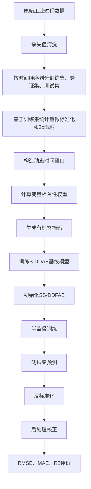
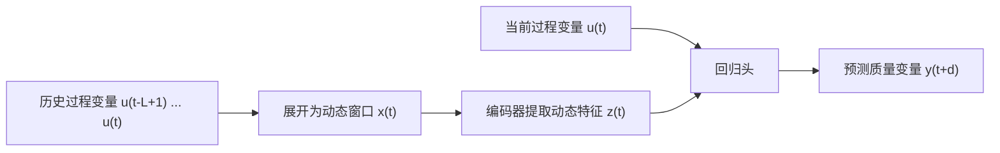
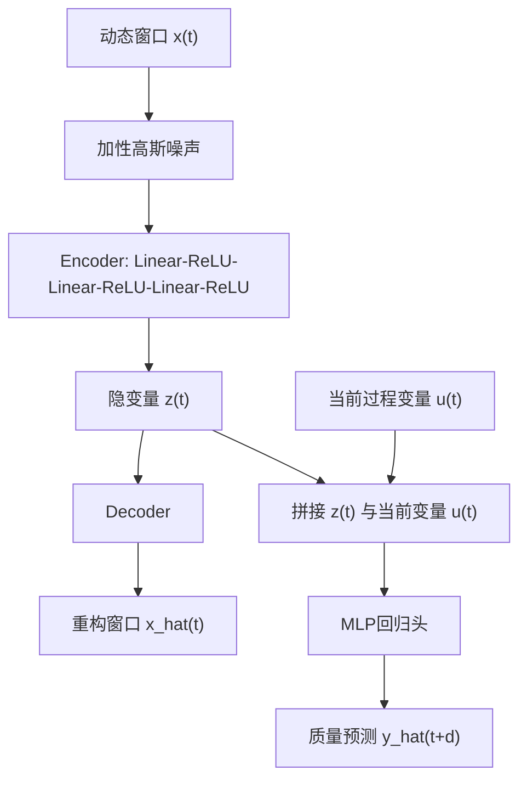
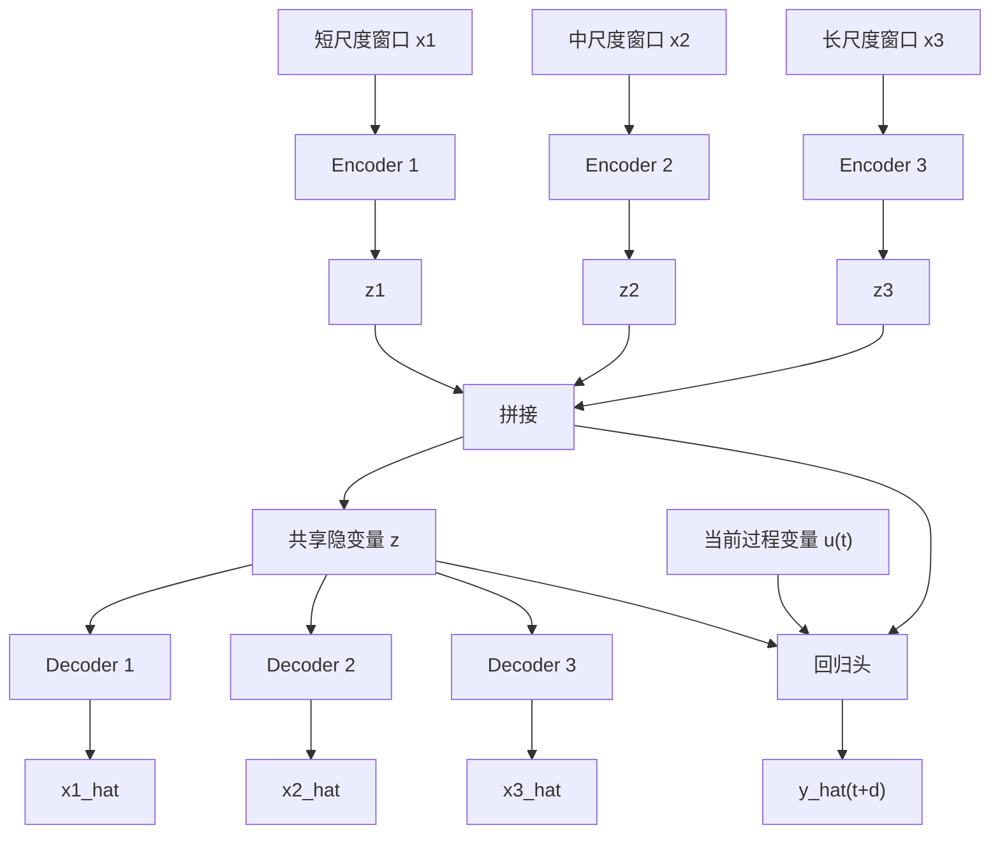
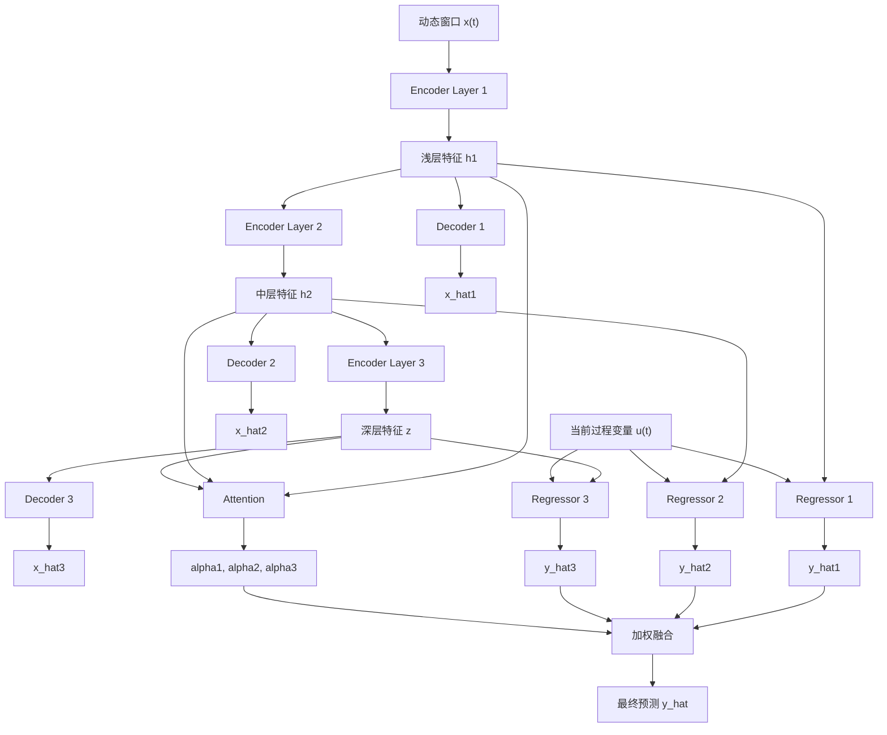
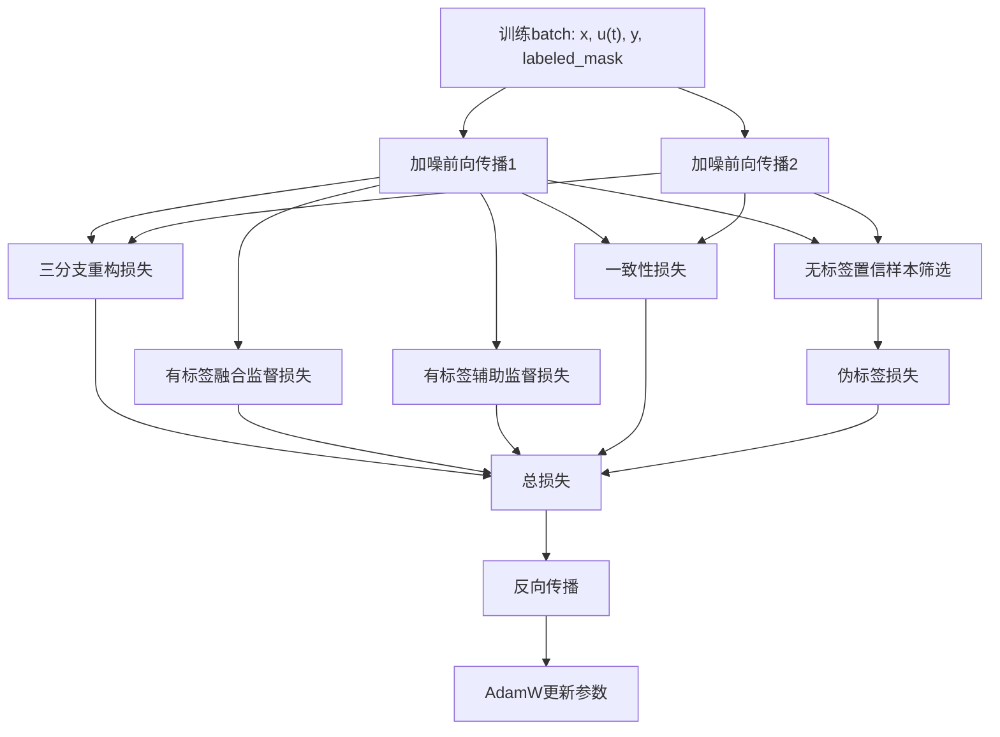
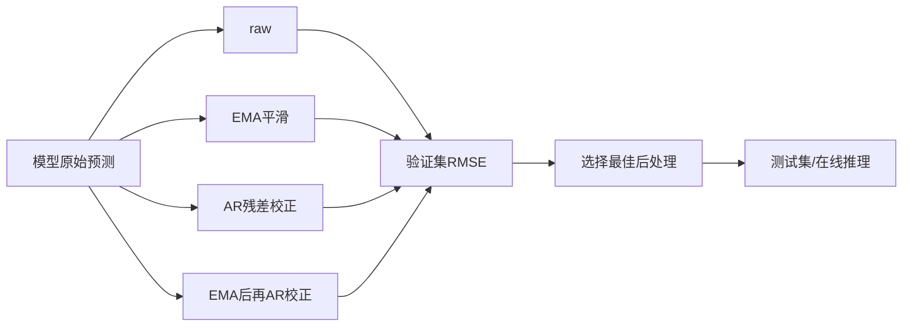
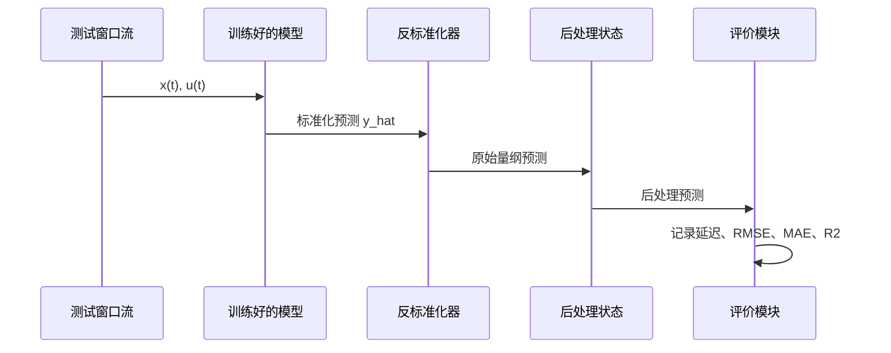

# DeepQuality 项目算法说明

## 1. 项目定位

DeepQuality 面向工业过程软测量任务。项目以连续采集的过程变量作为输入，预测难以在线实时测量的质量变量。当前默认数据集为 Debutanizer 数据集，包含 2394 条样本、7 个过程变量 `u1-u7` 和 1 个质量变量 `y`。项目也保留了 SRU 数据集，包含 10081 条样本、5 个过程变量和 2 个质量变量。

算法主线分为两类：

1. 监督动态降噪自编码器 S-DDAE：作为基础软测量模型。
2. 半监督动态深度融合自编码器 SS-DDFAE：在少量有标签样本下进一步利用无标签样本，并通过多层特征预测、注意力融合、一致性约束和伪标签提升建模能力。

项目整体流程如下：



## 2. 数据处理流程

### 2.1 数据读取

项目从 CSV 文件中读取数据，目标列默认为 `y`。除目标列之外的所有列都作为过程变量。设原始输入为：

$$
U=\{u_t\}_{t=1}^{N}, \quad u_t \in \mathbb{R}^{m}
$$

质量变量为：

$$
Y=\{y_t\}_{t=1}^{N}, \quad y_t \in \mathbb{R}
$$

Debutanizer 数据集中，$m=7$。

### 2.2 缺失值清洗

项目采用两步清洗：

1. 若连续缺失长度大于 `max_gap=5`，删除该连续缺失区间对应的样本行。
2. 若任一列缺失比例大于等于 `max_missing_ratio=0.01`，直接报错。
3. 对剩余缺失值按列进行线性插值。

该处理保留短时缺失序列的连续性，同时避免高缺失率变量进入模型。

### 2.3 时间顺序划分

工业过程数据具有时间相关性，项目不随机划分训练集、验证集、测试集，而是按时间顺序划分：

$$
D_{train}=D[0:0.7N]
$$

$$
D_{val}=D[0.7N:0.85N]
$$

$$
D_{test}=D[0.85N:N]
$$

默认训练集比例为 0.70，验证集比例为 0.15，测试集比例为 0.15。

### 2.4 标准化和异常裁剪

项目只使用训练集统计量拟合标准化器。对输入变量和输出变量分别计算均值与标准差：

$$
\mu_u,\sigma_u,\mu_y,\sigma_y
$$

标准化前先进行 3σ 裁剪：

$$
u_t^{clip}=\text{clip}(u_t,\mu_u-3\sigma_u,\mu_u+3\sigma_u)
$$

$$
y_t^{clip}=\text{clip}(y_t,\mu_y-3\sigma_y,\mu_y+3\sigma_y)
$$

之后执行标准化：

$$
\tilde{u}_t=\frac{u_t^{clip}-\mu_u}{\sigma_u}
$$

$$
\tilde{y}_t=\frac{y_t^{clip}-\mu_y}{\sigma_y}
$$

预测结束后，输出通过训练集的 $\mu_y,\sigma_y$ 反标准化回原始量纲。

### 2.5 动态窗口构造

工业过程具有动态滞后特性，单个时刻的过程变量不足以表达质量变量变化。因此项目将连续时间片展开为动态窗口。

单尺度窗口定义为：

$$
x_t=[\tilde{u}_{t-(L-1)s},\tilde{u}_{t-(L-2)s},\ldots,\tilde{u}_{t}] \in \mathbb{R}^{Lm}
$$

其中：

- $L$ 为窗口长度。
- $s$ 为采样步长，单尺度默认为 $s=1$。
- $m$ 为过程变量维度。

当前时刻过程变量单独保留为：

$$
u_t^{cur}=\tilde{u}_t
$$

它会和编码器提取的隐变量一起送入回归头。

质量变量存在检测或响应延迟，项目通过 `quality_delay` 显式建模：

$$
target_t=\tilde{y}_{t+d}
$$

其中 $d$ 为质量延迟。默认配置中 $L=40,d=12$。

窗口构造流程如下：



### 2.6 多尺度窗口

项目支持多尺度窗口。多尺度配置由若干组 `(window_size, stride)` 构成，例如：

$$
[(12,1),(24,2),(48,4)]
$$

第 $k$ 个尺度的窗口为：

$$
x_t^{(k)}=[\tilde{u}_{t-(L_k-1)s_k},\ldots,\tilde{u}_{t-s_k},\tilde{u}_t]
$$

多尺度输入能够同时覆盖短期、中期和长期动态信息。S-DDAE 支持单尺度和多尺度两种输入；SS-DDFAE 当前实现只支持单尺度输入。

### 2.7 相关性权重

项目在训练集有标签样本上计算每个过程变量与质量变量的相关性权重。第 $j$ 个变量的 Pearson 相关系数为：

$$
\rho_j=\text{corr}(u_j,y)
$$

Spearman 相关系数为：

$$
s_j=\text{corr}(\text{rank}(u_j),\text{rank}(y))
$$

综合相关性分数为：

$$
r_j=\frac{|\rho_j|+|s_j|}{2}
$$

再归一化到 $[0,1]$：

$$
w_j=\frac{r_j-\min(r)}{\max(r)-\min(r)+10^{-8}}
$$

窗口构造时，过程变量会先乘以权重：

$$
\bar{u}_{t,j}=w_j\tilde{u}_{t,j}
$$

该步骤使与质量变量关联更强的过程变量在输入窗口中占据更高权重。

### 2.8 有标签样本掩码

半监督训练需要模拟少标签场景。项目通过 `label_ratio` 控制训练集中有标签样本比例，例如 0.2、0.3、0.5、1.0。

设训练窗口数为 $n$，有标签比例为 $r$，则有标签样本数为：

$$
n_l=\text{round}(rn)
$$

项目使用固定随机种子生成样本排列，并构造嵌套式掩码。较小标签比例对应的有标签样本是较大标签比例的子集，便于公平比较不同标签比例下的模型性能。

## 3. S-DDAE 监督动态降噪自编码器

S-DDAE 是项目的基础模型。它同时学习两个任务：

1. 从加噪动态窗口中重构原始输入窗口。
2. 根据隐变量和当前过程变量预测未来质量变量。

### 3.1 单尺度网络结构

单尺度 S-DDAE 包含编码器、解码器和回归头。

编码器：

$$
h_1=\text{ReLU}(W_1x+b_1)
$$

$$
h_2=\text{ReLU}(W_2h_1+b_2)
$$

$$
z=\text{ReLU}(W_3h_2+b_3)
$$

解码器：

$$
\hat{x}=g(z)
$$

回归头：

$$
\hat{y}=f([z,u_t^{cur}])
$$

其中 $z$ 是低维动态表征，$u_t^{cur}$ 是当前时刻过程变量。



### 3.2 降噪机制

训练阶段向输入窗口加入高斯噪声：

$$
\tilde{x}=x+\sigma\epsilon,\quad \epsilon\sim\mathcal{N}(0,I)
$$

默认噪声标准差为 `noise_std=0.03`。模型使用加噪输入得到隐变量，但重构目标仍是原始输入窗口。这样编码器需要学习对噪声不敏感的动态特征。

### 3.3 训练目标

重构损失为：

$$
\mathcal{L}_{rec}=\text{MSE}(\hat{x},x)
$$

监督预测损失为：

$$
\mathcal{L}_{sup}=\text{MSE}(\hat{y},y)
$$

S-DDAE 分两阶段训练。

第一阶段为无监督预训练，只优化重构损失：

$$
\mathcal{L}_{pre}=\lambda_{rec}\mathcal{L}_{rec}
$$

第二阶段为监督微调，在有标签样本上优化：

$$
\mathcal{L}_{fine}=\lambda_{rec}^{fine}\mathcal{L}_{rec}+\lambda_{sup}\mathcal{L}_{sup}
$$

默认单尺度配置中：

- 预训练轮数：20。
- 微调轮数：120。
- 隐变量维度：32。
- 编码隐藏层维度：64、32。
- 学习率：0.0003。
- 权重衰减：0.0001。
- 梯度裁剪阈值：1.0。
- 早停指标：验证集 RMSE。

### 3.4 多尺度 S-DDAE

多尺度 S-DDAE 为每个时间尺度建立独立编码器。第 $k$ 个尺度得到分支隐变量：

$$
z_k=E_k(x_t^{(k)})
$$

所有分支隐变量拼接为：

$$
z_{cat}=[z_1,z_2,\ldots,z_K]
$$

共享隐变量为：

$$
z=\text{ReLU}(W_fz_{cat}+b_f)
$$

每个尺度使用独立解码器重构对应输入窗口：

$$
\hat{x}^{(k)}=D_k(z)
$$

预测时使用共享隐变量、拼接分支隐变量和当前过程变量：

$$
\hat{y}=f([z,z_{cat},u_t^{cur}])
$$



多尺度重构损失为各尺度重构误差的平均值：

$$
\mathcal{L}_{rec}^{ms}=\frac{1}{K}\sum_{k=1}^{K}\text{MSE}(\hat{x}^{(k)},x^{(k)})
$$

## 4. SS-DDFAE 半监督动态深度融合自编码器

SS-DDFAE 是项目的核心改进模型。它继承 S-DDAE 的动态降噪自编码思想，并引入三项机制：

1. 多层特征同时参与重构和预测。
2. 使用注意力机制融合不同深度的预测结果。
3. 在无标签样本上使用一致性约束和伪标签学习。

SS-DDFAE 训练前会读取已经训练好的单尺度 S-DDAE checkpoint，并复制兼容参数，包括三层编码器和最深层解码器参数。

### 4.1 网络结构

SS-DDFAE 使用三层编码特征：

$$
h_1=\text{ReLU}(W_1x+b_1)
$$

$$
h_2=\text{ReLU}(W_2h_1+b_2)
$$

$$
z=\text{ReLU}(W_3h_2+b_3)
$$

三个特征层分别接入解码分支：

$$
\hat{x}_1=D_1(h_1)
$$

$$
\hat{x}_2=D_2(h_2)
$$

$$
\hat{x}_3=D_3(z)
$$

三个特征层也分别接入辅助回归头：

$$
\hat{y}_1=f_1([h_1,u_t^{cur}])
$$

$$
\hat{y}_2=f_2([h_2,u_t^{cur}])
$$

$$
\hat{y}_3=f_3([z,u_t^{cur}])
$$

### 4.2 注意力融合

对每个特征层 $f_i\in\{h_1,h_2,z\}$，项目计算注意力得分：

$$
e_i=q_i(\tanh(W_if_i+b_i))
$$

注意力权重为：

$$
\alpha_i=\frac{\exp(e_i)}{\sum_{j=1}^{3}\exp(e_j)}
$$

最终预测为三个分支预测的加权和：

$$
\hat{y}=\sum_{i=1}^{3}\alpha_i\hat{y}_i
$$



### 4.3 双扰动前向传播

SS-DDFAE 每个训练 batch 执行两次加噪前向传播：

$$
\tilde{x}^{(1)}=x+\sigma\epsilon_1
$$

$$
\tilde{x}^{(2)}=x+\sigma\epsilon_2
$$

得到两组输出：

$$
O^{(1)}=M(\tilde{x}^{(1)})
$$

$$
O^{(2)}=M(\tilde{x}^{(2)})
$$

两次扰动共享同一个模型参数。它们用于重构损失、一致性损失和伪标签选择。

### 4.4 重构损失

SS-DDFAE 对三个解码分支分别计算重构误差，并对两次扰动结果取平均：

$$
\mathcal{L}_{rec}=\sum_{i=1}^{3}\omega_i\frac{\text{MSE}(\hat{x}_i^{(1)},x)+\text{MSE}(\hat{x}_i^{(2)},x)}{2}
$$

默认重构权重为：

$$
[\omega_1,\omega_2,\omega_3]=[0.5,0.3,0.2]
$$

### 4.5 有标签监督损失

设有标签样本掩码为 $m_l$。融合预测的监督损失为：

$$
\mathcal{L}_{sup}^{fus}=\text{MSE}(\hat{y},y)\quad \text{on } m_l
$$

三个辅助预测头的监督损失为：

$$
\mathcal{L}_{sup}^{aux}=\sum_{i=1}^{3}\beta_i\text{MSE}(\hat{y}_i,y)\quad \text{on } m_l
$$

默认辅助权重为：

$$
[\beta_1,\beta_2,\beta_3]=[0.2,0.3,0.5]
$$

### 4.6 一致性损失

对同一样本的两次加噪预测应保持一致，因此项目定义：

$$
\mathcal{L}_{con}=\text{MSE}(\hat{y}^{(1)},\hat{y}^{(2)})
$$

该损失同时作用于有标签和无标签样本。

### 4.7 伪标签损失

伪标签只在无标签样本上使用。设无标签掩码为：

$$
m_u=\neg m_l
$$

两次预测差值为：

$$
\Delta=|\hat{y}^{(1)}-\hat{y}^{(2)}|
$$

当 $\Delta<\tau$ 时，认为该无标签样本预测稳定。默认阈值为：

$$
\tau=0.05
$$

伪标签为两次预测的平均值：

$$
y^{pl}=\frac{\hat{y}^{(1)}+\hat{y}^{(2)}}{2}
$$

伪标签损失为：

$$
\mathcal{L}_{pl}=\text{MSE}(\hat{y}^{(1)},y^{pl})
$$

伪标签在 `pseudo_start=60` 轮之后启用。

### 4.8 Ramp-up 权重

一致性损失和伪标签损失使用 ramp-up 系数逐步加入训练。设当前轮数为 $e$，起始轮数为 $e_s$，结束轮数为 $e_e$：

$$
p=\frac{e-e_s}{e_e-e_s}
$$

$$
r(e)=\exp(-5(1-p)^2)
$$

当 $e<e_s$ 时，$r(e)=0$；当 $e\ge e_e$ 时，$r(e)=1$。默认 `ramp_start=20`，`ramp_end=60`。

### 4.9 总损失函数

SS-DDFAE 在 `ramp_start` 之前只优化重构损失：

$$
\mathcal{L}=\lambda_{rec}\mathcal{L}_{rec}
$$

`ramp_start` 之后，总损失为：

$$
\mathcal{L}=
\lambda_{rec}\mathcal{L}_{rec}
+\lambda_{sup}^{fus}\mathcal{L}_{sup}^{fus}
+\lambda_{sup}^{aux}\mathcal{L}_{sup}^{aux}
+r(e)(\lambda_{con}\mathcal{L}_{con}+\lambda_{pl}\mathcal{L}_{pl})
$$

默认配置为：

$$
\lambda_{rec}=0.05
$$

$$
\lambda_{sup}^{fus}=1.0
$$

$$
\lambda_{sup}^{aux}=0.2
$$

$$
\lambda_{con}=0.05
$$

$$
\lambda_{pl}=0.2
$$

SS-DDFAE 默认训练 200 轮，学习率为 0.0005，早停指标为验证集 RMSE。

### 4.10 半监督训练流程图



## 5. 后处理算法

模型输出经过反标准化后，项目支持四种后处理候选方法，并根据验证集 RMSE 选择最优方法。

### 5.1 原始输出

不做任何校正：

$$
\hat{y}_t^{post}=\hat{y}_t
$$

### 5.2 EMA 平滑

指数滑动平均为：

$$
\hat{y}_t^{ema}=\alpha\hat{y}_t+(1-\alpha)\hat{y}_{t-1}^{ema}
$$

候选 $\alpha$ 为 0.1 到 1.0。

### 5.3 AR(1) 残差校正

验证集残差定义为：

$$
e_t=y_t-\hat{y}_t
$$

项目拟合一阶自回归残差模型：

$$
e_t=c+\phi e_{t-1}
$$

预测阶段使用估计残差校正模型输出：

$$
\hat{y}_t^{ar}=\hat{y}_t+\hat{e}_t
$$

### 5.4 EMA + AR

先对预测结果做 EMA 平滑，再对平滑后的残差拟合 AR(1) 校正。候选方法包括 raw、ema、ar、ema+ar，最终选择验证集 RMSE 最小的方法用于测试集和在线模拟。



## 6. 在线推理流程

在线推理阶段加载 checkpoint，重新按训练配置构造数据处理流程，并逐样本执行预测。每个测试样本的流程为：

1. 取当前窗口 $x_t$ 和当前过程变量 $u_t^{cur}$。
2. 模型前向传播得到标准化预测值。
3. 反标准化为原始量纲。
4. 使用已选择的后处理状态进行单步校正。
5. 记录预测延迟和预测结果。

在线推理流程如下：



## 7. 评价指标

项目使用 RMSE、MAE 和 $R^2$ 评价预测性能。

RMSE：

$$
RMSE=\sqrt{\frac{1}{n}\sum_{i=1}^{n}(y_i-\hat{y}_i)^2}
$$

MAE：

$$
MAE=\frac{1}{n}\sum_{i=1}^{n}|y_i-\hat{y}_i|
$$

$R^2$：

$$
R^2=1-\frac{\sum_{i=1}^{n}(y_i-\hat{y}_i)^2}{\sum_{i=1}^{n}(y_i-\bar{y})^2+10^{-8}}
$$

所有指标均在反标准化后的原始量纲上计算。

## 8. 实验设计

项目代码支持以下实验维度。

### 8.1 标签比例实验

通过 `label_ratio` 比较不同标注比例下的模型表现：

$$
r\in\{0.2,0.3,0.5,1.0\}
$$

S-DDAE 在有标签子集上微调；SS-DDFAE 同时使用有标签样本和无标签样本。

### 8.2 窗口长度实验

通过改变 `window_size` 比较动态窗口长度对软测量性能的影响。项目实验脚本中包含 $L=3,5,7$ 等配置，默认配置为 $L=40$。

### 8.3 隐变量维度实验

通过改变 `latent_dim` 比较低维动态表征容量对预测性能的影响。项目实验脚本中包含 8、16、32 等配置，默认配置为 32。

### 8.4 质量延迟实验

项目支持搜索质量延迟：

$$
d\in\{0,2,4,6,8,10,12\}
$$

每个延迟值都会重新构造窗口标签对：

$$
x_t \rightarrow y_{t+d}
$$

再训练模型并比较测试集指标。

### 8.5 多尺度实验

多尺度 S-DDAE 使用多个窗口尺度同时建模。默认多尺度配置为：

$$
[(12,1),(24,2),(48,4)]
$$

实验脚本也包含：

$$
[(40,1),(24,2),(12,4)]
$$

多尺度实验主要用于比较单一时间尺度和多时间尺度动态信息对预测精度的影响。

## 9. 可写入论文的方法描述

本项目可以概括为一种面向工业过程软测量的半监督动态深度融合自编码方法。首先，对连续工业过程数据进行时间顺序划分、缺失值处理、标准化和质量延迟对齐；然后，利用动态窗口将历史过程变量展开为模型输入，并根据有标签训练样本计算过程变量与质量变量之间的 Pearson-Spearman 综合相关权重；随后，训练监督动态降噪自编码器，通过重构任务学习稳健的动态隐表示，并通过回归头建立隐表示、当前过程变量与未来质量变量之间的映射；最后，在少标签条件下，将 S-DDAE 的参数迁移至 SS-DDFAE，利用多层编码特征构建多解码分支和多预测分支，通过注意力机制融合不同深度的预测结果，并在无标签样本上引入双扰动一致性约束和置信伪标签损失，从而提高少标签工业软测量建模效果。

SS-DDFAE 的核心目标函数为：

$$
\mathcal{L}=
\lambda_{rec}\sum_{i=1}^{3}\omega_i\mathcal{L}_{rec}^{i}
+\lambda_{sup}^{fus}\mathcal{L}_{sup}^{fus}
+\lambda_{sup}^{aux}\sum_{i=1}^{3}\beta_i\mathcal{L}_{sup}^{i}
+r(e)(\lambda_{con}\mathcal{L}_{con}+\lambda_{pl}\mathcal{L}_{pl})
$$

其中，$\mathcal{L}_{rec}^{i}$ 表示第 $i$ 个解码分支的重构损失，$\mathcal{L}_{sup}^{fus}$ 表示注意力融合预测的有标签监督损失，$\mathcal{L}_{sup}^{i}$ 表示第 $i$ 个辅助预测头的有标签监督损失，$\mathcal{L}_{con}$ 表示双扰动预测一致性损失，$\mathcal{L}_{pl}$ 表示无标签置信样本的伪标签损失，$r(e)$ 为随训练轮数逐步增大的 ramp-up 系数。

## 10. 算法伪代码

### 10.1 数据准备

```text
输入：原始CSV数据、窗口长度L、质量延迟d、标签比例r
输出：训练/验证/测试窗口数据、标签掩码、标准化器

1. 读取过程变量U和质量变量Y
2. 删除长连续缺失片段，对短缺失片段线性插值
3. 按时间顺序划分训练集、验证集、测试集
4. 使用训练集计算均值和标准差
5. 对所有划分执行3σ裁剪和标准化
6. 在训练集上生成有标签掩码
7. 使用有标签训练样本计算相关性权重
8. 构造动态窗口 x(t) 和延迟标签 y(t+d)
```

### 10.2 S-DDAE 训练

```text
输入：训练窗口、验证窗口、标签掩码
输出：S-DDAE checkpoint

1. 初始化编码器、解码器、回归头
2. 预训练阶段：
   对全部训练窗口加噪
   最小化输入重构损失
3. 微调阶段：
   只使用有标签训练窗口
   最小化监督预测损失和可选重构损失
4. 每轮在验证集计算RMSE
5. 保存验证集RMSE最小的模型参数
6. 在测试集预测并计算RMSE、MAE、R2
```

### 10.3 SS-DDFAE 训练

```text
输入：S-DDAE checkpoint、训练窗口、验证窗口、标签掩码
输出：SS-DDFAE checkpoint

1. 初始化SS-DDFAE
2. 从S-DDAE复制兼容的编码器和解码器参数
3. 对每个训练batch执行两次加噪前向传播
4. 计算三分支重构损失
5. ramp_start之前只优化重构损失
6. ramp_start之后加入：
   融合预测监督损失
   辅助预测监督损失
   双扰动一致性损失
7. pseudo_start之后，对无标签置信样本加入伪标签损失
8. 使用AdamW更新参数
9. 保存验证集RMSE最小的模型参数
10. 在测试集预测并计算RMSE、MAE、R2
```

## 11. 论文结构建议

该项目可对应论文中的以下章节：

1. 数据预处理：缺失值处理、时间顺序划分、标准化、动态窗口、质量延迟建模、相关性加权。
2. 基线模型：监督动态降噪自编码器 S-DDAE。
3. 改进模型：半监督动态深度融合自编码器 SS-DDFAE。
4. 半监督学习机制：标签掩码、一致性约束、伪标签学习、ramp-up 权重。
5. 在线预测与后处理：EMA 平滑、AR 残差校正、在线单步推理。
6. 实验设置：标签比例、窗口长度、隐变量维度、质量延迟、多尺度输入。
7. 实验评价：RMSE、MAE、$R^2$。
